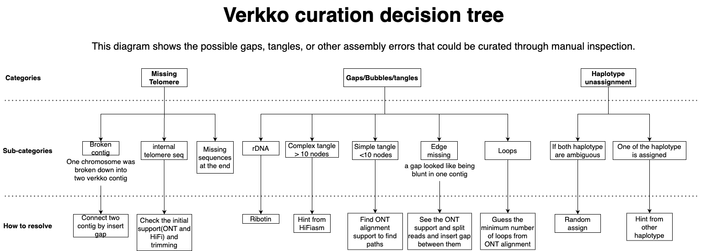

## Types of gap

Verkko is a very powerful tool for assembling long-read data to generate a complete diploid assembly, but it still has some limitations, such as generating gaps, tangles, missing telomeres, and more. These issues can occur due to sequencing errors, lower sample quality, or overly complex or homogeneous sequences, which are difficult to assemble. As a result, some manual inspection is needed. Below, we classify the scenarios that can lead to gaps in the assembly and their potential solutions.

**1. Missing Telomeres**

- **Broken Contig**: This can occur when large tangles or gaps exist in the middle of a contig, causing Rukki to split the contig. This can be resolved by connecting the contigs with a gap in the Rukki path.
  
- **Internal Telomere Sequencing**: In this case, additional sequences are added after the telomere, preventing the `getT2T` function from detecting the telomere and reporting the contig as a scaffold, even if it contains an internal telomere. This issue might arise due to ONT sequencing bias and can be fixed by trimming the sequences before the internal telomere after identifying its start position.

- **Missing Sequence at the End**: If you see isolated telomere-attached nodes, you can find homologous nodes to determine the counterpart of the haplotype on the chromosome and stitch them together by inserting a gap.

**2. Gaps, Bubbles, and Tangles**

- **rDNA**: The number of rDNA arrays and their morphs vary by species, and rDNA sequences are too similar to be assembled automatically. We recommend running `ribotin` to find the consensus of the rDNA sequences and patch the assembly with the rDNA consensus.

- **Complex Tangles**: Sometimes, Hifiasm can generate longer contigs that cover tangles in the Verkko assembly. We can use the HiFi assembly to align it on the Verkko graph and get hints from the alignment to resolve the walk on the nodes.

- **Simple Tangles or Bubbles**: In this scenario, ONT alignments on the Verkko graph using `graphaligner` can be helpful. Searching for supported paths that connect nodes in the gap can help resolve simple tangles.

- **Edge Missing**: If your assembly has missing edges between two nodes, this might be due to too few supported ONT reads (<3) connecting the nodes. We can find the supported split ONT reads aligned on nearby nodes and add the edge to the graph.

- **Loops**: Repeated sequences with multiple copies can be problematic to assemble, especially when the repeat is long enough to span ONT reads at both ends of the flanking nodes. In this case, we edit the gaps with the estimated number of loops and fill the gaps with semi-filled gaps.

**3. Haplotype Unassignment**

- **One Haplotypes is Ambiguous**: This scenario occurs when heterozygous nodes flank long runs of homozygous nodes, making Verkko unsure which haplotype should be assigned. If we have evidence that the other haplotype has already been assigned to one of the nodes in the gap, we can assign the other haplotype to the ambiguous node.

- **Both Haplotypes are Ambiguous**: When both haplotypes have gaps in a bubble, there’s no way to determine the correct haplotype for the gap. In this case, we will randomly assign the haplotypes. This can be corrected during the polishing step later.
