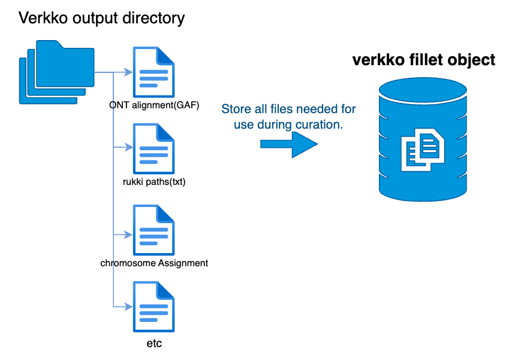

## Usage Principles

Import `verkko-fillet` as :
```python
import verkkofillet as vf
```

## How to use
The `verkkofillet` module, abbreviated as `vf`, consists of three sub-modules: `pp`, `tl`, and `pl`.

- **`vf.tl`**: Provides tools for running shell scripts.  
- **`vf.pp`**: Includes modules for preprocessing and modifying datasets.  
- **`vf.pl`**: Dedicated to plotting and visualization.  

The typical workflow consists of subsequent calls of data analysis tools in `vf.tl`, e.g.:
```python
vf.tl.getT2T(obj, **tool_params)
```
where obj is an verkko-fillet object.    

## Verkko-fillet object

`verkko-fillet` is based on the verkko-fillet object, which collects relevant files and stores them within the object itself. Various sub-attributes, such as `.gaps`, `.stats`, and others, are stored as Pandas DataFrames, allowing users to flexibly analyze the data and save it separately to local storage if needed.

The available attributes are as follows:
* `.verkkoDir`: Directory containing the verkko results.
* `.verkko_fillet_dir`: Output directory for verkko-fillet results.
* `.paths`: Path file extracted from `assembly.paths.tsv`.
* `.version`: Genome version.
* `.species`: Genome species.
* `.stats`: Assembly statistics (e.g., contig and chromosome information, completeness).
* `.gaps`: Gap information extracted from the  `.path` file.
* `.gaf`: Graph alignment results (GAF format).
* `.qv`: Quality value (QV) calculation results using meryl and merqury.
* `.history`: Log of all modifications made during the gap-filling process.
* `.scfmap`: Assembly scaffold mapping file (assembly.scfmap).